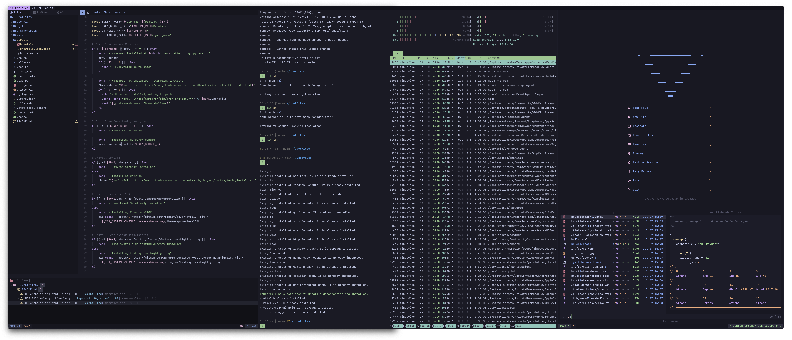

# System Configuration and Automation

> [!NOTE]
> This configuration includes several keyboard shortcuts for app launching, window management, text editing and other automations, which are specifically optimized to work with [my custom keyboard / layout](https://github.com/minusfive/zmk-config). If you want to use it, you'll likely want to make some changes (primarily to [Hammerspoon](./.config/hammerspoon/), [Wezterm](./.config/wezterm/) and [NeoVim](./.config/nvim/) configurations.

## Bootstrap and Update

> [!WARNING]
> This will modify system settings and install software. You should read and understand [the bootstrap script](./scripts/bootstrap.sh) and [Nix Flake](./flake.nix) before proceeding.

To setup or update a new machine run [the bootstrap script](./scripts/bootstrap.zsh):

```sh
git clone git@github.com:minusfive/dotfiles.git ~/.dotfiles
cd ~/.dotfiles
./scripts/bootstrap.zsh
```

### Programs

#### Nix, nix-darwin and Home Manager

Primary OS configuration and software installation + management is handled by [Nix](https://nixos.org/), using the [nix-darwin](https://github.com/LnL7/nix-darwin) (macOS) and [Home Manager](https://github.com/nix-community/home-manager) (user configuration) modules, with some help from [Homebrew](https://brew.sh) (macOS package manager) and [GNU Stow](https://www.gnu.org/software/stow/) (symlink manager).

These are the [programs](./nix/programs/) currently installed by Nix on my machine:

<https://github.com/minusfive/dotfiles/blob/51cf975a5c392a0a73fd74730ceb11e1fa0ed3a6/nix/users/minusfive/aarch64-darwin.nix#L3-L39>


