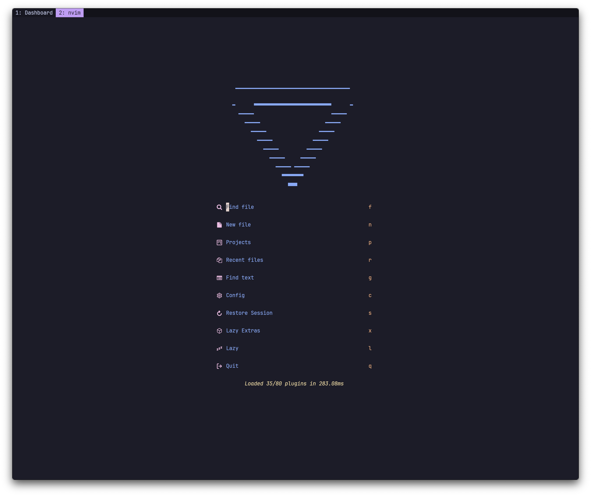

# Configuration Files

> [!IMPORTANT]
> My configuration is specifically optimized to work with [my custom keyboard / layout](https://github.com/minusfive/zmk-config). If you want to use it, you will likely want to make some changes.

## Tools

- [Hammerspoon](https://www.hammerspoon.org/)
- [Neovim](https://neovim.io/)
- [LazyVim](https://www.lazyvim.org/)
- [WezTerm](https://wezfurlong.org/wezterm/)
- [Zsh](https://www.zsh.org/)
- [Oh My Zsh](https://ohmyz.sh/)
- [Powerlevel10k](https://github.com/romkatv/powerlevel10k)

## To Do

- [ ] Improve this README file
