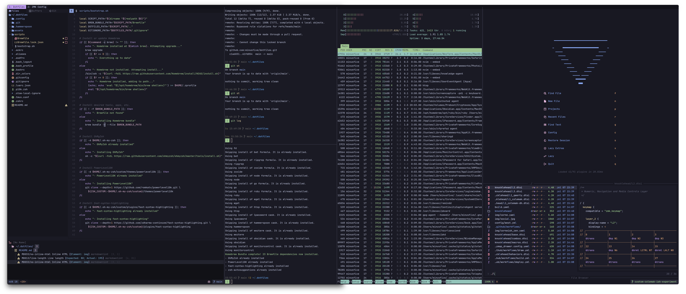

# Personal System Config

This branch uses [Homebrew](https://brew.sh), [mise-en-place](https://mise.jdx.dev), [GNU Stow](https://www.gnu.org/software/stow/), and custom [Zsh](https://www.zsh.org/) scripts to configure macOS the way I like it.

I try my best to keep this and [my Nix-based configuration](https://github.com/minusfive/tree/nix) synchronized, but depending on which type of machine I'm working with more regularly, I may prioritize one configuration over the other.

> [!NOTE]
> This configuration includes several keyboard shortcuts (for app launching, window management, text editing, etc.), optimized to work with [my custom keyboard layout](https://github.com/minusfive/zmk-config) and workflow. To customize you'll likely want to primarily look at the following configurations:
>
> - [Hammerspoon](./.config/hammerspoon/)
> - [Wezterm](./.config/wezterm/)
> - [NeoVim](./.config/nvim/)

## Setup

> [!WARNING]
> This will modify system settings, install, and configure software. You should read and understand [the init script](./scripts/init.zsh) and the [other scripts it calls](./scripts/) before proceeding.

To setup a new machine or update a current one, run:

```sh
git clone --single-branch --branch main git@github.com:minusfive/dot.git ~/dev/dot
cd ~/dev/dot
./scripts/init.zsh
```

## Programs

System package state is managed by [mise-en-place](https://mise.jdx.dev) (see [~/.config/mise/config.toml](./.config/mise/config.toml) and [~/.config/mise/mise.personal.toml](./.config/mise/mise.personal.toml)), including Homebrew formulae, Homebrew casks, and Mac App Store apps. [Homebrew](https://brew.sh) is now only an optional bootstrap helper, while development tooling and setup flows continue through `mise` and the [Zsh scripts](./scripts/).

---



---

## Development

This project uses the tools it manages, so setting up the machine should set everything up for development. Switching to
the repository directory should automatically install the project-specific dependencies via [mise-en-place](https://mise.jdx.dev).
